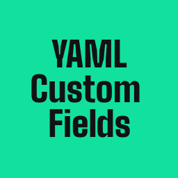

# YAML Custom Fields

[](https://github.com/maliMirkec/yaml-custom-fields)
[](https://wordpress.org/)
[](https://php.net)
[](https://www.gnu.org/licenses/gpl-2.0.html)

A WordPress plugin for managing YAML frontmatter schemas in theme templates and partials. Define structured content with an intuitive interface and ACF-like template functions.



## Features

### Core Functionality

- **YAML Schema Management** - Define schemas for page templates and template partials
- **15+ Field Types** - String, rich-text, images, blocks, taxonomies, data objects, and more
- **Easy-to-use Admin Interface** - Manage schemas and data with a clean, intuitive UI

### Advanced Data Management

- **Three-level Data Hierarchy:**
  - **Per-page data** - Individual customization stored in post meta
  - **Per-template global data** - Shared across all posts using the same template
  - **Site-wide global data** - For partials like headers and footers

- **Per-field Global/Local Toggle** - Each field can independently use template global data or page-specific data
- **Visual Dual-field Interface** - See both template global and page-specific values side-by-side
- **Auto-merge Data Hierarchy** - Intelligent data priority: page > template global > site global

### Content Features

- **Data Objects** - Manage structured, reusable data (universities, companies, team members, etc.)
- **Data Validation** - Review imported content for consistency
- **Export/Import** - Consolidated functionality for settings, page data, and data objects
- **Simple Template Functions** - ACF-like syntax with auto-merge behavior

### Developer-Friendly

- **WordPress Coding Standards Compliant**
- **Administrator-only Access** for security
- **Clean Uninstall** - Removes all database records
- **Scoped Dependencies** - No conflicts with other plugins using Symfony components

## Supported Field Types

| Field Type | Description |
|------------|-------------|
| **string** | Single-line text with min/max length |
| **text** | Multi-line textarea |
| **rich-text** | WordPress WYSIWYG editor |
| **code** | Code editor with syntax highlighting |
| **boolean** | Checkbox for true/false values |
| **number** | Number input with min/max constraints |
| **date** | Date picker with optional time |
| **select** | Dropdown with single/multiple selection |
| **taxonomy** | WordPress categories, tags, or custom taxonomies |
| **post_type** | Dropdown to select registered post types |
| **data_object** | Reference to structured data objects |
| **image** | WordPress media uploader for images |
| **file** | WordPress media uploader for any file |
| **object** | Nested group of fields |
| **block** | Repeatable blocks for flexible page builders |

## Installation

### From WordPress Plugin Directory

1. Log in to your WordPress admin dashboard
2. Navigate to **Plugins → Add New**
3. Search for "YAML Custom Fields"
4. Click **Install Now** next to the YAML Custom Fields plugin
5. Click **Activate** after installation completes
6. Go to **YAML Custom Fields** in the admin menu to configure your schemas

### Manual Installation

1. Download the plugin ZIP file
2. Log in to your WordPress admin dashboard
3. Navigate to **Plugins → Add New → Upload Plugin**
4. Choose the ZIP file and click **Install Now**
5. Click **Activate** after installation completes
6. Go to **YAML Custom Fields** in the admin menu to configure your schemas

### Requirements

- WordPress 5.0 or higher
- PHP 7.4 or higher
- The plugin includes all necessary dependencies

## Quick Start

### 1. Enable YAML for a Template

1. Go to **YAML Custom Fields** in the admin menu
2. Find your template (e.g., `page.php`) in the list
3. Toggle **Enable YAML** to ON
4. Click **Add Schema**

### 2. Define a Schema

```yaml
fields:
  - name: hero_title
    label: Hero Title
    type: string
    required: true
    options:
      maxlength: 100
  - name: hero_image
    label: Hero Image
    type: image
  - name: category
    label: Category
    type: taxonomy
    options:
      taxonomy: category
  - name: features
    label: Features
    type: block
    list: true
    blockKey: type
    blocks:
      - name: feature
        label: Feature Block
        fields:
          - name: title
            label: Title
            type: string
          - name: icon
            label: Icon
            type: image
```

### 3. Use in Your Theme

```php
<?php
// Get field values
$hero_title = ycf_get_field('hero_title');
$hero_image = ycf_get_image('hero_image', null, 'full');
$category = ycf_get_term('category');
$features = ycf_get_field('features');
?>

<div class="hero">
  <?php if ($hero_image): ?>
    "
         alt="<?php echo esc_attr($hero_image['alt']); ?>">
  <?php endif; ?>

  <h1><?php echo esc_html($hero_title); ?></h1>

  <?php if ($category): ?>
    <span class="category"><?php echo esc_html($category->name); ?></span>
  <?php endif; ?>
</div>

<?php if (!empty($features)): ?>
  <div class="features">
    <?php foreach ($features as $block): ?>
      <?php
      $title = ycf_get_field('title', null, $block);
      $icon = ycf_get_image('icon', null, 'thumbnail', $block);
      ?>
      <div class="feature">
        <?php if ($icon): ?>
          ">
        <?php endif; ?>
        <h3><?php echo esc_html($title); ?></h3>
      </div>
    <?php endforeach; ?>
  </div>
<?php endif; ?>
```

## Template Functions Reference

### Get Field Value

```php
// Basic usage
$value = ycf_get_field('field_name');

// Specific post ID
$value = ycf_get_field('field_name', 123);

// From partial
$value = ycf_get_field('logo', 'partial:header.php');

// From block context
$value = ycf_get_field('title', null, $block);
```

### Get Image Field

```php
$image = ycf_get_image('field_name', null, 'full');
// Returns: array('id', 'url', 'alt', 'title', 'caption', 'description', 'width', 'height')
```

### Get File Field

```php
$file = ycf_get_file('field_name');
// Returns: array('id', 'url', 'path', 'filename', 'filesize', 'mime_type', 'title')
```

### Get Taxonomy Field

```php
$term = ycf_get_term('field_name');
// Returns: WP_Term object or array of WP_Term objects (for multiple selection)
```

### Get Post Type Field

```php
$post_type = ycf_get_post_type('field_name');
// Returns: WP_Post_Type object or null
```

### Get Data Object Field

```php
$university = ycf_get_data_object('field_name');
// Returns: Array with data object entry fields or null

// Get all entries of a data object type
$all_universities = ycf_get_data_objects('universities');
```

### Check Field Existence

```php
if (ycf_has_field('hero_title')) {
    echo ycf_get_field('hero_title');
}
```

## Template Global Fields

Template Global Fields allow you to define default values shared across all posts using the same template, while still allowing individual posts to override specific fields.

### Setting Up Template Global

1. Go to **YAML Custom Fields** admin page
2. Enable YAML for your template (e.g., `page.php`)
3. Click **Add Template Global** to define the template global schema
4. Define fields that should have shared default values
5. Click **Manage Template Global Data** to set the default values

### Using Template Global in Posts

When editing a post that uses a template with Template Global fields, you'll see a dual-field interface:

- **Template Global (All Pages)** - Read-only display showing the default value (with Edit link)
- **Page-Specific Value** - Editable field for this post only
- **Checkbox** - "Use template global for this field" - Toggle per field

### Benefits

- **Consistency:** Set default values once, use across all posts
- **Flexibility:** Override any field on any post individually
- **Clarity:** See both global and local values side-by-side
- **Efficiency:** Update template global to affect all posts at once

### Data Priority

When using template functions, data is returned in this priority order:

1. Page-specific value (if "use template global" is unchecked)
2. Template global value (if "use template global" is checked)
3. Site-wide global value (if template has site-wide global enabled)
4. null (if no value exists)

## Working with Partials

For custom partials, add the `@ycf` marker in the file header:

```php
<?php
/**
 * Custom Navigation Partial
 * @ycf
 */
```

Then click **Refresh Template List** in the YAML Custom Fields admin page.

## Data Objects

Data Objects allow you to manage structured, reusable data independently from posts and pages.

**Use Cases:**
- Universities or educational institutions
- Companies or organizations
- Team members or staff
- Locations or venues
- Products or services

**How to Use:**

1. Go to **YAML Custom Fields → Data Objects**
2. Create a new data object type (e.g., "universities")
3. Define the schema with fields
4. Add entries for each university
5. Reference in your page schemas using the `data_object` field type

## Developer Guide

### Building from Source

If you're developing or modifying the plugin, follow these steps:

#### Prerequisites

- PHP 7.4 or higher
- Composer

#### Installation

```bash
# Clone the repository
git clone https://github.com/maliMirkec/yaml-custom-fields.git
cd yaml-custom-fields

# Install Composer dependencies
composer install

# Build scoped dependencies (prevents conflicts with other plugins)
chmod +x build-scoped.sh
./build-scoped.sh
```

The `build-scoped.sh` script uses PHP-Scoper to namespace the Symfony YAML dependencies under the `YamlCF\Vendor` namespace, preventing conflicts with other plugins.

#### Development Workflow

1. Make your changes to the plugin files
2. If you modify Composer dependencies, run `./build-scoped.sh` again
3. Test the plugin in a WordPress development environment
4. Commit your changes (the `build/` directory is included in the repository)

### Data Storage

- **Page/Post data:** Post meta with key `_yaml_cf_data`
- **Template Global preferences:** Post meta with key `_yaml_cf_use_template_global_fields`
- **Template Global schemas:** Options table with key `yaml_cf_template_global_schemas`
- **Template Global data:** Options table with key `yaml_cf_template_global_data`
- **Site-wide global schema:** Options table with key `yaml_cf_global_schema`
- **Site-wide global data:** Options table with key `yaml_cf_global_data`
- **Partial data:** Options table with key `yaml_cf_partial_data`
- **Schemas:** Options table with key `yaml_cf_schemas`
- **Data Object Types:** Options table with key `yaml_cf_data_object_types`
- **Data Object Entries:** Options table with keys `yaml_cf_data_object_entries_{type_slug}`

### Hooks and Filters

The plugin provides several hooks for extensibility:

```php
// Modify field output before rendering
add_filter('yaml_cf_field_value', function($value, $field_name, $post_id) {
    // Your custom logic
    return $value;
}, 10, 3);
```

## Frequently Asked Questions

### What is YAML frontmatter?

YAML frontmatter is a structured way to define metadata for content. It's commonly used in static site generators and headless CMS systems. YAML Custom Fields brings this approach to WordPress themes.

### How is this different from ACF?

While ACF is a comprehensive custom fields solution, YAML Custom Fields focuses on YAML-based schemas that are portable and version-controllable. It's ideal for developers who prefer code-first approaches and want simpler, more predictable data structures.

### Can I use this with my existing theme?

Yes! YAML Custom Fields works with any WordPress theme. You define schemas for your templates and use simple PHP functions to retrieve the data in your template files.

### Does this work with Gutenberg?

Yes, YAML Custom Fields is compatible with both the Classic and Block (Gutenberg) editors. The custom fields appear below the editor regardless of which editor you're using.

### What happens to my data if I deactivate the plugin?

Your data remains in the database. Only when you **delete** the plugin (not just deactivate) will it clean up all settings, schemas, and custom field data.

## Contributing

Contributions are welcome! Please follow these guidelines:

1. Fork the repository
2. Create a feature branch (`git checkout -b feature/amazing-feature`)
3. Make your changes following WordPress Coding Standards
4. Test your changes thoroughly
5. Commit your changes (`git commit -m 'Add some amazing feature'`)
6. Push to the branch (`git push origin feature/amazing-feature`)
7. Open a Pull Request

## Support

- **Documentation:** [Plugin Documentation](https://github.com/maliMirkec/yaml-custom-fields)
- **Issues:** [Report Issues](https://github.com/maliMirkec/yaml-custom-fields/issues)
- **WordPress Support:** [WordPress.org Plugin Support](https://wordpress.org/support/plugin/yaml-custom-fields/)

## Changelog

### 1.2.4

- **REFACTOR: Assets Folder Structure** - Reorganized assets for WordPress.org compliance
- **IMPROVED: File Organization** - Separated admin assets (CSS/JS) into 'admin-assets' folder
- **IMPROVED: Plugin Assets** - Moved WordPress.org assets (icons, banners, screenshots) to 'assets' folder
- **UPDATED: File References** - Updated all asset paths in templates and AssetManager

### 1.2.3

- **FIX: Dynamic Block Fields** - Fixed taxonomy, post_type, and data_object fields not rendering correctly in dynamically added blocks
- **NEW: JavaScript Field Handlers** - Added missing post_type and data_object field support to JavaScript block rendering
- **IMPROVED: Field Type Parity** - All field types now work identically in both static (PHP) and dynamic (JavaScript) rendering
- **IMPROVED: Data Localization** - Enhanced controllers to pass taxonomy terms, post types, and data objects to JavaScript

### 1.2.2

- **UPDATED: Symfony Libraries** - Updated Symfony YAML Component to 6.4 and Deprecation Contracts to 3.6.0 for PHP 8.1+ compatibility
- **SECURITY: Nonce Verification** - Fixed GET parameter access to verify nonces before accessing other parameters
- **IMPROVED: Script Enqueuing** - Converted all inline scripts to proper wp_enqueue_script usage with wp_localize_script
- **REQUIREMENT: PHP 8.1+** - Minimum PHP version requirement (Symfony 6.4 LTS supports PHP 8.1+)

### 1.2.1

- **FIX: Export/Import** - Template global schemas and data now properly exported and imported
- **FIX: Page Data Export** - Schema is now included in page data exports (form-based and AJAX)
- **FIX: Page Data Import** - Now correctly handles both single-post and multi-post export formats
- **NEW: Template Global Readonly Display** - Template-global-only fields now display as readonly in post editor
- **NEW: Auto-fallback for Template Global Fields** - `ycf_get_field()` now automatically retrieves template global data
- Fixed browser autocomplete issues with template global form fields

### 1.2.0

- **NEW: Template Global Fields** - Define shared default values for all posts using the same template
- **NEW: Per-field global/local toggle** - Each field can independently use template global or page-specific data
- **NEW: Dual-field interface** - Visual side-by-side comparison of template global and page-specific values
- **NEW: Auto-merge data hierarchy** - Intelligent data priority system (page > template global > site global)
- Enhanced post editor UI with clear visual indicators for global vs local data
- Improved field rendering system with unique IDs for dual fields
- Added per-field preferences storage for granular control
- Better reset functionality that preserves global data
- Enhanced documentation with Template Global Fields guide
- Improved admin interface organization for template management

### 1.1.0

- Improved code quality and WordPress Coding Standards compliance
- Consolidated Export/Import functionality into single admin page
- Enhanced database query performance with optimized caching strategy
- Improved input sanitization and output escaping for better security
- Added production-safe logging system with WordPress hooks
- Better file upload validation and error handling

### 1.0.0

- Initial release
- Support for 15+ field types
- Template and partial support
- ACF-like template functions
- Data Objects feature
- Export/Import functionality
- Administrator-only access
- Clean uninstall

[View full changelog →](readme.txt)

## Privacy Policy

YAML Custom Fields does not collect, store, or transmit any user data outside of your WordPress installation. All data is stored locally in your WordPress database.

## Third-Party Libraries

This plugin includes the following third-party libraries:

- **Symfony YAML Component** (v5.4) - Licensed under MIT License (GPL-compatible)
  - Homepage: https://symfony.com/components/Yaml
  - License: https://github.com/symfony/yaml/blob/5.4/LICENSE

## Credits

- **Author:** [Silvestar Bistrovic](https://www.silvestar.codes)
- **Contributors:** [View all contributors](https://github.com/maliMirkec/yaml-custom-fields/graphs/contributors)

## License

This plugin is licensed under the [GPL v2 or later](https://www.gnu.org/licenses/gpl-2.0.html).

```
YAML Custom Fields
Copyright (C) 2024 Silvestar Bistrovic

This program is free software; you can redistribute it and/or modify
it under the terms of the GNU General Public License as published by
the Free Software Foundation; either version 2 of the License, or
(at your option) any later version.

This program is distributed in the hope that it will be useful,
but WITHOUT ANY WARRANTY; without even the implied warranty of
MERCHANTABILITY or FITNESS FOR A PARTICULAR PURPOSE. See the
GNU General Public License for more details.
```

---

**Last Updated:** 2026-01-06
**Plugin Version:** 1.2.4
**Maintained By:** Silvestar Bistrović

Made with ❤️ by [Silvestar Bistrovic](https://www.silvestar.codes)
